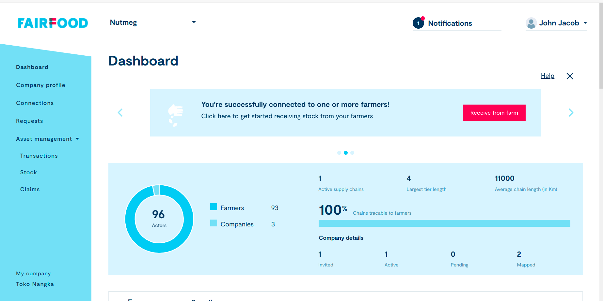

# Trace Server V2
This is the server side repo of trace application.


Fairfood is a traceability solution system. Trace is an easy-to-use blockchain-based platform that allows agri-food businesses to make their supply chain transparent and trace their products from farm to fork.
Under Fairfood we basically have a few apps, namely,

* Trace which is used to view connections, do transactions, and manage stocks for a particular company,

* Admin section which is used to manage a list of companies under an admin,

* Consumer interface which is basically used to tace or track stocks from their interception/source to their final destination.



## Usefull links
You can refer the [confluence spce](https://rightorigins.atlassian.net/l/cp/ZXP3u3sK) to find out more about the project. Follwoing are some quick links that can be usefull to paint a quick picture,
* [Architecture Diagram](https://rightorigins.atlassian.net/wiki/external/887259334/MmFjOTMyNDVlMTY0NGY1ZDhlNTE5OTNjNzhlNzQyNmM?atlOrigin=eyJpIjoiZTJhYTg5MjQyN2IyNDFkM2I5NGZmYTA4Y2VkYTVkZDIiLCJwIjoiYyJ9)
* [Project glossary](https://rightorigins.atlassian.net/l/cp/q0Z5Btin)

## Prerequisites
* Python 3.6.9
* Postgres 10.19
* virtualenv

## Setup instructions
* Update your system using the command :
```sh
  sudo apt update
```
* Install essentials given below:
```sh
  sudo apt install python3-pip
  sudo apt install git
```

* Create virtualenv and activate
```sh
  sudo pip install virtualenv
  sudo pip install virtualenvwrapper
  source /usr/local/bin/virtualenvwrapper.sh
```
* Setup gitlab ssh:

Just create key and go to gitlab. in user settings their we can add ssh public key.
```sh
ssh-keygen -t rsa -b 4096
```
* Create the fairtrace_v2 env using the following command:
```sh
mkproject -p python3 fairtrace_v2
```
* clone the project
```sh
$ git clone https://git.cied.in/fairfood/trace-v2/backend/fairtrace_v2.git .
```
* After cloning:
```sh
* git fetch origin <env_name>
* git checkout <env_name>
* git pull origin <env_name>
```
* Next to create secret file:
```sh
mkdir /etc/secret/
mkdir /etc/secret/fairtrace_v2/
```
Copy the file sample_secret.ini to etc/fairtrace/secrete.ini and update the varialbes if necessary.

* Install Postgres and related libraries:
```sh
* sudo apt-get install postgresql postgresql-contrib libpq-dev gdal-bin postgis
```
* Create the database user and the database:

First, switch to the postgres system user account and run the psql command as follows:

```sh
$ sudo su - postgres
$ psql
postgres=#
```
Now create a new database and a user using the following commands.

```sh
postgres=# CREATE USER fairtrace_v2 WITH PASSWORD 'fairtrace_v2';
postgres=# CREATE DATABASE fairtrace_v2;
postgres=# GRANT ALL PRIVILEGES ON DATABASE fairtrace_v2 to fairtrace_v2;
postgres=# \q
```

* Installing pgAdmin4
```sh
  * curl https://www.pgadmin.org/static/packages_pgadmin_org.pub
  * sudo sh -c 'echo "deb https://ftp.postgresql.org/pub/pgadmin/pgadmin4/apt/$(lsb_release -cs) pgadmin4 main" > /etc/apt/sources.list.d/pgadmin4.list && apt update'
  * sudo apt install pgadmin4
```

* Install requirements
```sh
$ pip install requirements/local.txt
```
If there is an error occur when install pillow library. Then install pillow as:
```sh
python3 -m pip install Pillow
```
After that complete the requirement installation.

## Run the project using Docker

#### Prerequisites

Make sure you have already installed Docker in your local. This is only for running in local to test it.

For further details please have a look at the [official Docker documentation](https://docs.docker.com/engine/installation/).

#### Run
* create a copy of sample.env and rename it to .env
* run
```sh
$ docker-compose up
```
#### Restore database
* Visit server auth and set up dev server ssh
* run
```sh
$ fab2 backup-development-db
```
* copy the db to fab/config/db and replace the current file.

## Run tests

```commandline
$ ./manage.py test
```
### For coverage report
```commandline
$ ./manage.py moudle_coverage_report
```
